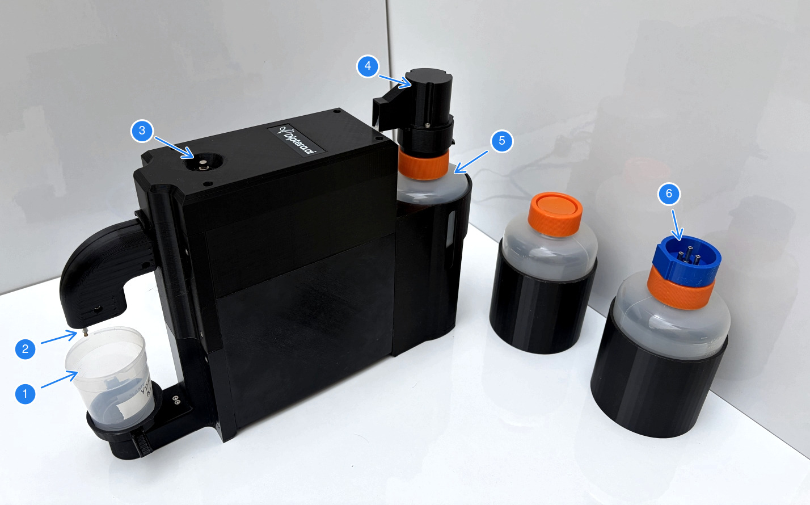
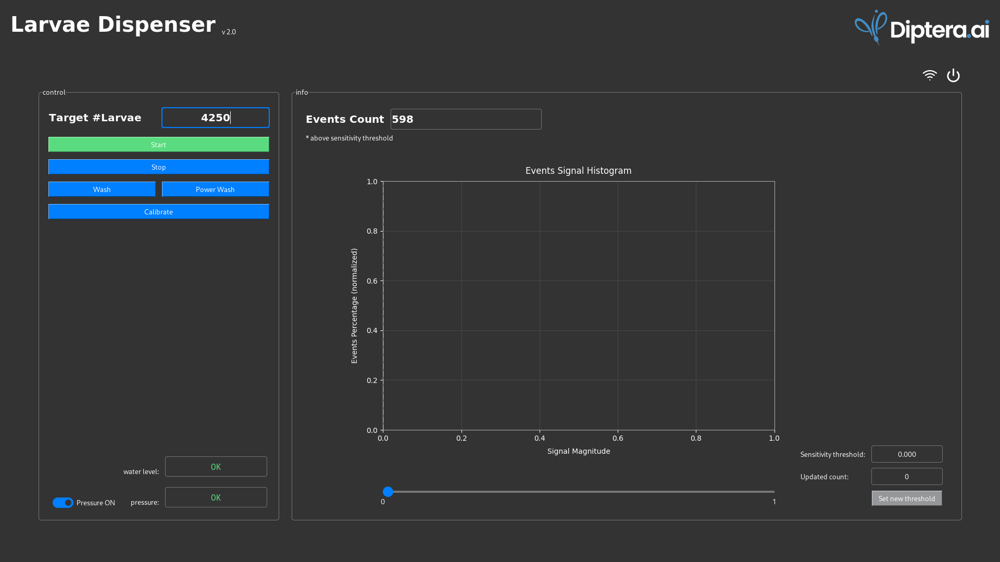
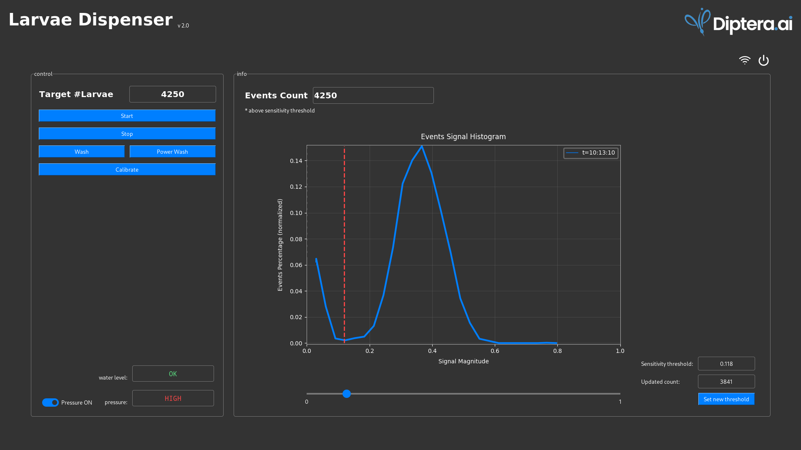
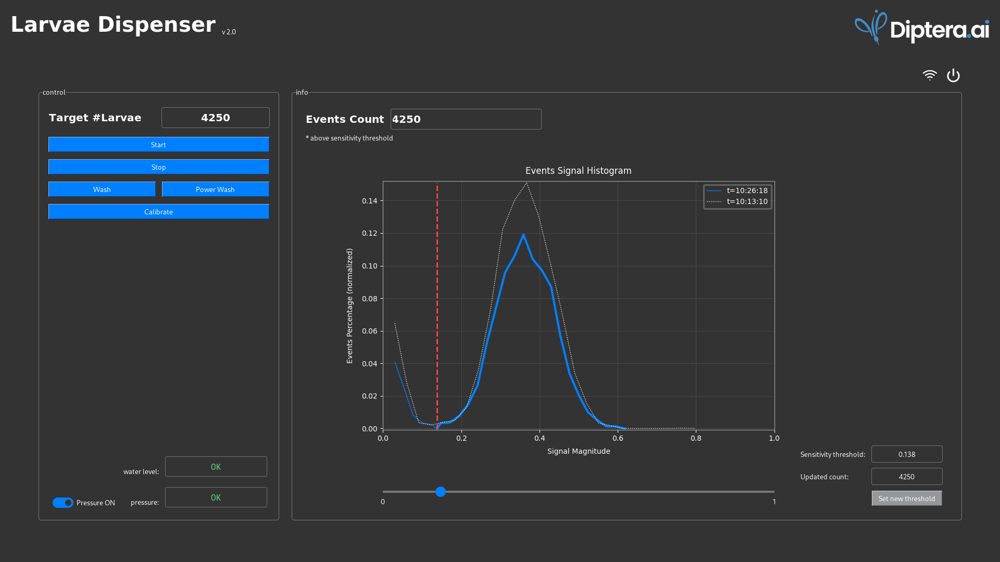

# Larvae Dispenser &emsp;[v 2.0] 
 
|Version:|[1.2](https://github.com/Diptera-ai/LarvaeDispenser/tree/main)|[2.0](https://github.com/Diptera-ai/LarvaeDispenser/tree/v2)|
|---|---|---|
 

The Larvae Dispenser, by [Diptera.ai](https://diptera.ai "Diptera.ai's Homepage"), is designed to achieve fast and reliable mosquito larvae aliqouting. By utilizing an optical counting sensor and a controlled pump system, it eliminates the manual labor and inconsistency of hand-pipetting larvae for large-scale studies.

This product is currently under development.

 

Table of Contents

- [Overview](#Overview)
    - [Components](#Components)
    - [Software](#Software)
    - [Basic Setup](#BasicSetup)
- [Protocol](#Protocol)  
    [1. Startup](#Startup)  
    [2. New Bottle](#NewBottle)  
    [3. Aliquot](#Aliquot)  
    [4. Finish](#Finish)  
- [Q&A](#Q&A)
    - [Larvae preperation](#prep-larvae)
    - [Opening a pressurised bottle](#open-bottle)
    - [Blockage detection and clearing](#blockage)
    - [Why WiFi?](#wifi)

 

## Overview
 

### Components

1. Output cup
2. Outlet tube
3. Pressure release valve
4. Bottle plug
5. Input bottle - larvae in water (orange + black)
6. Input bottle - clean water (orange + blue)

 

### Software

The program allows you to control, monitor, and analyze the aliquoting.  
The window is split to the control panel on the left, and info panel to its right.  
- On the control panel, from top to bottom: input box for target number of larvae, basic operation buttons for start/stop/wash/calibrate, and system pressure switch.  
- On the info panel, first is the live count readout for total number of events. Below it a graph showing the most recent data histograms. On the bottom, sensitvity threshold control.  

### Basic Setup

- Connect a mouse and a monitor to the Larvae Dispenser.
- Connect to your WiFi[*](#wifi).
- Set the pressure release valve:
  1. With **Pressure Off**, place a larvae bottle (black) filled **with clean water only**, make sure the bottle cap, and then the bottle plug on top, are closed tightly.
  2. Place a new output cup.
  3. Make sure the valve is closed.
  4. Turn **Pressure On**.
  5. Very slowly, open the valve. Stop as soon as you hear/see bubbles in the bottle: Bubbling should be continuous and not sporadic, pressure should be resting on 'OK', and the pump should not be loud.
- If the system was powered off, to turn it back on you will need to unplug it from the socket and plug it back in.

> [!TIP]
> If the amount of water in consequtive aliqoutes (of the same size) is rising, it could indicate there is a problem with the pressure or bubbling of the bottle. 

> [!IMPORTANT]
> Once adjusted, the pressure release valve should not be changed during normal operation. 

 

# Protocol
 

## 1. **Startup**
> [!NOTE]
> Perform a wash and calibration, with clean water, to 'zero' the system. This should be done at the beginng of a new day, or after reboot.

1. Connect a blue bottle with **clean** water, make sure it is closed tightly. 
2. Place an output cup.
3. Make sure pressure is on, and stable ('OK').
4. Press **Wash**. 
4. Press **Calibrate**. 

Note that, as can be seen in the [screenshot above](#fig0), at startup the Start button will appear gray, indicating a calibration is required.
> [!CAUTION]
> Do not open a pressurised bottle. see [here](#open-bottle)).

## 2. **New Bottle**
> [!NOTE]
> When loading a new bottle with larvae, run an initial aliquot for the purpose of setting the sensitivity threshold - this, essentially, allows to ignore events that were probably caused by debris or other small particles. 

1. Prepare larvae according to [this](#prep-larvae) and fill a new bottle.
> [!IMPORTANT]
> Larvae density should be in the range of 4000-8000 larvae per bottle (0.5L water).

2. Connect the new bottle to the system: 
- If another bottle is already connected, remember to turn off the pressure before disconnecting it. 
- Connect the new bottle. Make sure it is closed tightly. Turn the pressure on.
3. Place a clean output cup.
4. Press **Wash**. The purpose of this wash is to fill the tubes with larvae water and rid of any bubbles. 
- Once you see larvae in the cup, you may stop the wash.
- Empty the cup or place a new one.
5. Set the **Target #Larvae**.  
   For the purpose of setting the sensitivity threshold, assuming you have a full bottle, it is recommended to aliquot at least 1000 larvae.
6. Press **Start**. \
   The system will begin running larvae from the bottle to the cup and automatically stop when it reaches the target number of events detected. The **Start** button will show green while the system is running (i.e. counting), and a live count is updated simultaneously.
> [!NOTE]
> If an aliqout fails to complete within 5 minutes, a timeout is triggered and the counting will stop.

 

<small>When counting, the start button shows green and the Events Count is updated live.</small>

 

7. Once finished, the plot will be updated with a **histogram of the events' signal magnitudes**. Big larvae will be detected as high magnitude events, and vice versa - small particles will show as low magnitude events.\
   The legend depicts different runs by their initiation timestamps.
   The most recent measurement is the one in thick blue line, previous runs will appear in dashed lines. \
   Below, for example, a screenshot of the program after the first run.

 

<small>Once the count finished, the plot is updated with the events' signal histogram.</small>
 
 

8. Set the **sensitivity threshold**, and press **Set new threshold** to get a new reading of the total updated count. 
- The sensitivity threshold is 0.0 by default. This means that all events are counted as larvae. However, typically, larvae water contain some particles smaller than the larvae. These particles will show in the histogram as noise, or a (small) peak of the curve on the leftmost side of the histogram.  \
Examining the histogram and setting the sensitivity threshold to the first minima to the left of the main peak on the right hand side, let's call it the **debris-larvae minima**, allows you to remove from the count events that were probably caused by debris and small particles.
- Using the horizontal scale below the plot, you may test new sensitivity thresholds (marked by a red vertical line) and see how applying it affects the count. 
In the example below, resetting the sensitivity threshold to *0.118* updated the count to 3841 events. \
Pressing **Set new threshold** will apply the change and keep that threshold for later runs too (now the line appears black).

- This step is usually required only after the **first** aliquot with a new bottle. Consecutive aliquots from the same bottle typically share the same size distribution and therefore the same debris-larvae minima.
- Note that the total number of larvae for this cup is jeopardised. In the example below, you can expect there to be only 3841 larvae in the cup, not 4250 as the given target. This is because, of course, the sensitivity threshold was set to 0.0 for this measurement.

 

> [!NOTE]
> Set the **sensitivity threshold** to the first minima to the left of the main peak on the right, and press **Set new threshold**.

<small>Trying a new sensitivity threshold to remove events caused by small particles.</small>
 
 

<small>After pressing **Set new threshold**, the newly selected sensitivity threshold is applied and saved for future runs.</small>
 
 

## 3. **Aliquot** 

1. Set the **Target #Larvae**. \
It is recommended to aliquot at least 250 larvae every time.
2. Place an empty output cup.
3. Press **Start**. \
The system will begin an aliquot, running larvae from the bottle to the cup and automatically stop when it reaches the target number of events detected - AFTER applying the sensitivity threshold. I.E., smaller events than the threshold will be ignored.
- You may press the **Stop** button at any time during the run, if need be. Note, this will stop the ongoing aliquot without an option to resume it.
- Repeat as needed.
  
 

<small>A consecutive run from the same bottle is expected to share the same debris-larvae minima.</small>
 
 

- Make sure the water level in the bottle does not go below the lower marking of 25cc, as this will make the count inaccurate and may cause errors.\
If water level reaches the lower marking, add water to the bottle. 

 

## 4. **Finish**
> [!IMPORTANT]
> Wash the system thoroughly after use. 

1. Open the bottle (remember to depressurise first, see [here](#open-bottle)).
2. Remove remaining larvae in the bottle, and clean the bottle thoroughly. The metallic tubes of the larvae bottle should be washed (inside and out) with a washer bottle.
3. Fill the bottle with clean water (or use the second clean water bottle with the blue connectors cap) and close it tightly.
4. Place an output cup.
5. Switch **Pressure On** and press **Wash**/**Pressure Wash**. Repeat wash 3 times.
6. Press Shutdown. System reports will be sent to Diptera.ai if connected to the internet.

 

## Q&A

 

- How to prepare larvae for aliquoting?
    - For the most accurate results, make sure the sample is as clean as possible. Separate larvae from smaller particles by using a 50-mesh strainer. Clean the strainer from debris and repeat a couple of times.
    - Before putting larvae into the bottle, make sure that the bottle is clean from larvae, debris or other small particles.
    - Add lukewarm (~25C) water with larvae to the bottle.  
    - Do not fill the bottle above the 450ml line.
    - Larvae density should be between 4,000 to 8,000 larvae per bottle i.e. 0.5L of water.

- How to open the bottle when the system is pressurised?
   - Switch **Pressure Off**.
   - Wait 10 seconds or so for pressure to relieve.
   - Pop the bottle plug.

- How to detect and clear a **blockage** in the Larvae Dispenser?
  - **Detecting** a blockage: \
  If a significant decrease or complete stop in flow is observed during larvae counting, it may indicate a blockage in the tubing.
  - **Preperations**:
    1. If the machine is still counting, stop it. 
    2. Turn pressure off.
    3. There should be a syringe with flexible tube that can replace the outlet tube (plastic and brass). Fill it with clean water. 
    4. Replace the regular outlet tube with the syringe, see GIF below.
    5. Replace the input bottle with a new larvae bottle (orange+black cap, not blue) filled with clean water.
  - **Flushing** the blockage: 
    1. Flush: Press the **Wash** button in the program. After you hear a click sound, gently push water through the tubing by pressing the syringe plunger slowly.
    2. Check flow: Wait 1 minute or until you hear a second click sound. Then remove the syringe and place an output cup. Press the **Wash** button in the program and observe whether normal flow has resumed.
    3. Repeat if necessary: If the flow has not returned to normal, repeat the flushing procedure using a slightly greater amount of water.
  - **Finish**:
    1. Rid of the water in the input bottle, as the artifact which caused the blockage might be there, and resume normal protocol.

<small>Preparing to remove blockage using a syringe</small>

- Why WiFi?
   - With internet access, the Larvae Dispencer can periodically receive software updates and send system reports to Diptera.ai.
   - If need be, Diptera.ai can remotely configure advanced parameters or help diagnose errors.

